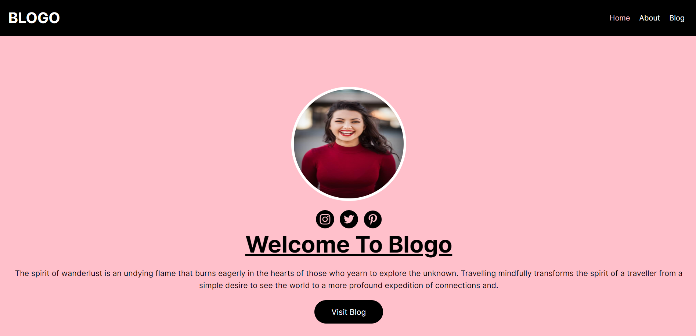

# Blogo - Next.js 13 Simple Blog

Blogo is a lightweight and elegant blog application built using Next.js 13, designed to showcase your stories and articles in a clean and intuitive manner. With a focus on simplicity and modern design, Blogo makes it easy for both writers and readers to engage with your content.

## Features

- **Next.js 13**: Experience the power of the latest Next.js version, offering enhanced performance, improved developer experience, and exciting new capabilities.
- **Responsive Design**: Blogo is designed to look great on various devices and screen sizes, ensuring a seamless experience for your readers whether they're on a desktop, tablet, or smartphone.
- **Multiple Pages**: The app comes with multiple pages, including a Home page that introduces your blog, an About page to tell your story, and a dynamic Blog page that lists all your captivating posts.
- **Single Post View**: Clicking on a specific blog post from the Blog page leads to a dedicated Post page, allowing readers to fully immerse themselves in your content without distractions.
- **Customizable Menu**: The `Menu.jsx` component provides an easy way to navigate through different sections of your blog, maintaining a consistent user experience.
- **Netlify Deployment**: Seamlessly deploy your Blogo application on Netlify to make it accessible to a global audience.

## Getting Started

Follow these simple steps to set up and run Blogo on your local machine:

1. Clone this repository: `git clone https://github.com/your-username/blogo.git`
2. Navigate to the project directory: `cd blogo`
3. Install dependencies: `npm install`
4. Start the development server: `npm run dev`
5. Access the application in your browser at `http://localhost:3000`

## Contributing

Contributions are welcome and encouraged! If you find a bug or have an idea for an enhancement, feel free to open an issue or submit a pull request.

## License

This project is licensed under the MIT License. Feel free to use, modify, and distribute the code as needed.

---

Let Blogo help you share your thoughts and stories with the world. Start your blogging journey with Next.js 13 today!

Visit the live demo: [https://storied-kelpie-a798f7.netlify.app/](https://storied-kelpie-a798f7.netlify.app/)
